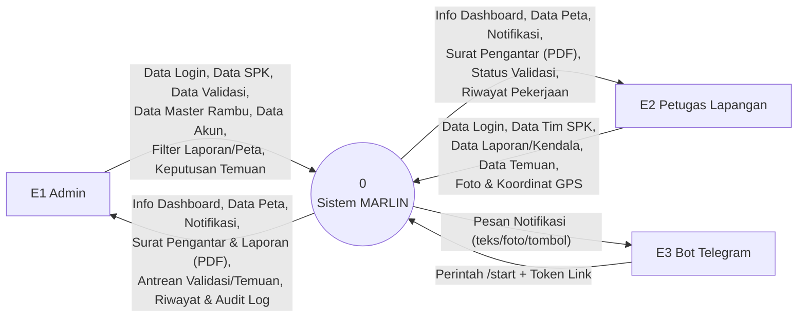
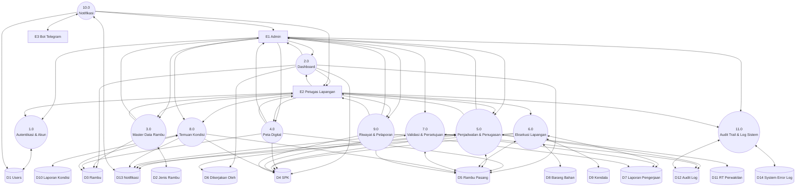
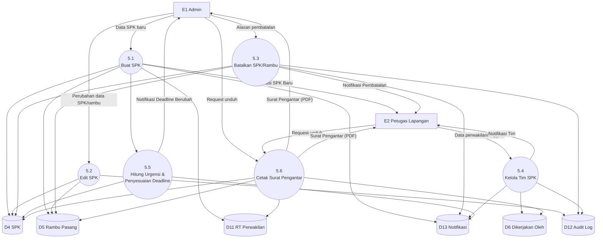
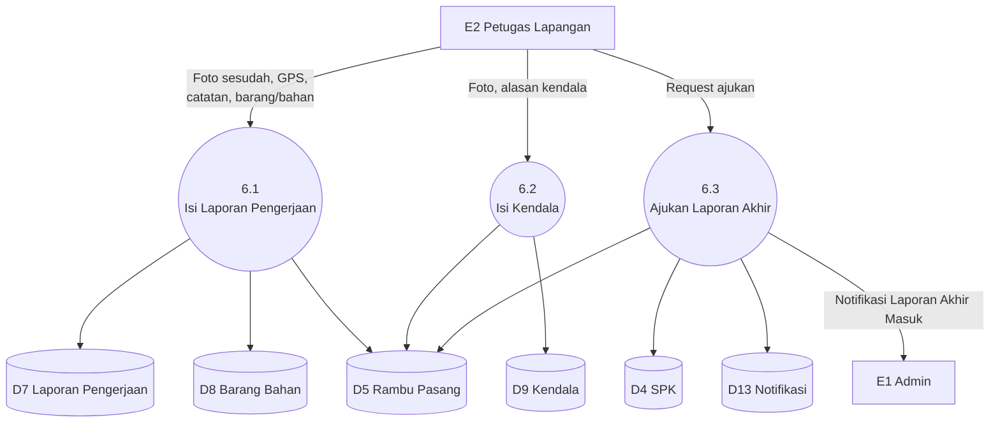
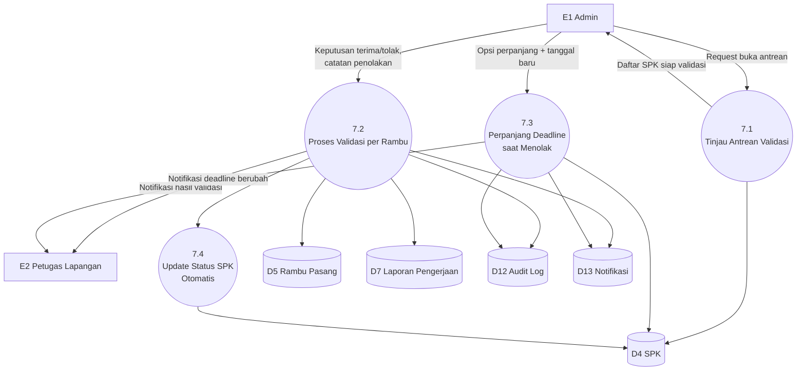

# Data Flow Diagram (DFD) Sistem MARLIN

Rancangan DFD untuk sistem MARLIN (Manajemen Rambu Lalu Lintas), disusun berdasarkan fitur dan alur bisnis yang sudah benar-benar diimplementasikan (lihat [FITUR.md](FITUR.md), [ALUR-BISNIS.md](ALUR-BISNIS.md), [DAFTAR-AKTIVITAS.md](DAFTAR-AKTIVITAS.md), [DATABASE.md](DATABASE.md)), bukan rancangan awal/aspirasional.

Notasi yang dipakai (gaya Yourdon/DeMarco):
- **Entitas Eksternal** — kotak persegi.
- **Proses** — lingkaran/bubble bernomor.
- **Data Store** — bentuk silinder, diberi kode `D1`, `D2`, dst., merujuk langsung ke tabel database di [DATABASE.md](DATABASE.md).
- **Aliran Data** — anak panah berlabel.

---

## Daftar Isi

- [Entitas Eksternal & Data Store](#entitas-eksternal--data-store)
- [DFD Level 0 (Diagram Konteks)](#dfd-level-0-diagram-konteks)
- [Diagram Berjenjang (Hierarchy Chart)](#diagram-berjenjang-hierarchy-chart)
- [DFD Level 1](#dfd-level-1)
- [DFD Level 2](#dfd-level-2)
  - [Level 2 — Proses 5.0 Penjadwalan & Penugasan (SPK)](#level-2--proses-50-penjadwalan--penugasan-spk)
  - [Level 2 — Proses 6.0 Eksekusi Lapangan](#level-2--proses-60-eksekusi-lapangan)
  - [Level 2 — Proses 7.0 Validasi & Persetujuan](#level-2--proses-70-validasi--persetujuan)

---

## Entitas Eksternal & Data Store

### Entitas Eksternal

| Kode | Nama | Deskripsi |
|---|---|---|
| E1 | Admin | Staf Dishub yang membuat SPK, memvalidasi laporan, mengelola master data & akun. |
| E2 | Petugas Lapangan | Mengerjakan SPK di lapangan, mengirim laporan/kendala, melapor temuan kondisi. |
| E3 | Bot Telegram | Layanan eksternal (Telegram Bot API) — menerima pesan notifikasi dari sistem dan mengirim balik perintah `/start` untuk konfirmasi penghubungan akun. |

### Data Store

Satu data store per tabel domain (tabel bawaan Laravel seperti `sessions`/`cache`/`jobs` tidak dimasukkan karena bukan bagian dari alur bisnis).

| Kode | Nama Data Store | Tabel |
|---|---|---|
| D1 | Data Pengguna | `users` |
| D2 | Data Jenis Rambu | `jenis_rambu` |
| D3 | Data Rambu | `rambu` |
| D4 | Data SPK | `spk` |
| D5 | Data Rambu Pasang | `rambu_pasang` |
| D6 | Data Tim SPK | `dikerjakan_oleh` |
| D7 | Data Laporan Pengerjaan | `laporan_pengerjaan` |
| D8 | Data Barang/Bahan | `barang_bahan` |
| D9 | Data Kendala | `kendala` |
| D10 | Data Temuan Kondisi | `laporan_kondisi` |
| D11 | Data RT/Perwakilan | `rt_perwakilan` |
| D12 | Data Audit Log | `audit_log` |
| D13 | Data Notifikasi | `notifikasi` |
| D14 | Data Log Error Sistem | `system_error_log` |

---

## DFD Level 0 (Diagram Konteks)

### Rincian Aliran Data — Level 0

| Kode | Dari | Ke | Nama Aliran Data | Keterangan |
|---|---|---|---|---|
| F1 | Admin | Sistem | Data Login | NIP + password, kode 2FA |
| F2 | Admin | Sistem | Data SPK | Buat/edit/batalkan SPK beserta daftar rambu |
| F3 | Admin | Sistem | Data Validasi | Keputusan terima/tolak laporan, opsi perpanjangan deadline |
| F4 | Admin | Sistem | Data Master Rambu | CRUD jenis rambu |
| F5 | Admin | Sistem | Data Akun Petugas | Tambah/ubah/aktifkan/nonaktifkan akun |
| F6 | Admin | Sistem | Filter Laporan & Peta | Rentang tanggal, jenis rambu, status |
| F7 | Admin | Sistem | Keputusan Tindak Lanjut Temuan | Buat SPK perbaikan dari temuan / tolak temuan |
| F8 | Sistem | Admin | Info Dashboard Admin | Ringkasan SPK aktif, rambu rusak, laporan menunggu validasi |
| F9 | Sistem | Admin | Data Peta | Pin rambu + kartu info sesuai status |
| F10 | Sistem | Admin | Notifikasi | Laporan akhir masuk, temuan baru, dll. |
| F11 | Sistem | Admin | Surat Pengantar & Laporan (PDF) | Surat pengantar, Laporan Bulanan, Laporan Rambu |
| F12 | Sistem | Admin | Riwayat & Audit Log | Riwayat SPK, jejak aksi bisnis kunci lintas pengguna |
| F13 | Petugas | Sistem | Data Login | NIP + password |
| F14 | Petugas | Sistem | Data Tim SPK | Daftarkan diri, tambah/hapus anggota |
| F15 | Petugas | Sistem | Data Laporan Pengerjaan/Kendala | Foto, koordinat GPS, catatan, alasan, barang/bahan |
| F16 | Petugas | Sistem | Data Temuan Kondisi | Foto + catatan kerusakan rambu |
| F17 | Sistem | Petugas | Info Dashboard Petugas | Daftar surat aktif, ringkasan tugas tim |
| F18 | Sistem | Petugas | Data Peta | Pin rambu + kartu info sesuai status |
| F19 | Sistem | Petugas | Notifikasi | SPK baru tersedia, hasil validasi, dikeluarkan dari tim, dll. |
| F20 | Sistem | Petugas | Surat Pengantar (PDF) | Dokumen kerja untuk dibawa ke lapangan |
| F21 | Sistem | Telegram | Pesan Notifikasi | Teks/foto/tombol tautan, dikirim lewat Bot API |
| F22 | Telegram | Sistem | Perintah `/start` + Token | Konfirmasi penghubungan akun Telegram pengguna |

---

## Diagram Berjenjang (Hierarchy Chart)

```mermaid
graph TD
    S[0 Sistem MARLIN]

    S --> P1[1.0 Autentikasi & Manajemen Akun]
    S --> P2[2.0 Dashboard]
    S --> P3[3.0 Manajemen Data Rambu]
    S --> P4[4.0 Peta Digital Interaktif]
    S --> P5[5.0 Penjadwalan & Penugasan SPK]
    S --> P6[6.0 Eksekusi Lapangan]
    S --> P7[7.0 Validasi & Persetujuan]
    S --> P8[8.0 Temuan Kondisi]
    S --> P9[9.0 Riwayat & Pelaporan]
    S --> P10[10.0 Notifikasi]
    S --> P11[11.0 Audit Trail & Log Sistem]

    P5 --> P51[5.1 Buat SPK]
    P5 --> P52[5.2 Edit SPK]
    P5 --> P53[5.3 Batalkan SPK / Batalkan Rambu]
    P5 --> P54[5.4 Kelola Tim SPK]
    P5 --> P55[5.5 Hitung Urgensi & Penyesuaian Deadline]
    P5 --> P56[5.6 Cetak Surat Pengantar]

    P6 --> P61[6.1 Isi Laporan Pengerjaan]
    P6 --> P62[6.2 Isi Kendala]
    P6 --> P63[6.3 Ajukan Laporan Akhir]

    P7 --> P71[7.1 Tinjau Antrean Validasi]
    P7 --> P72[7.2 Proses Validasi per Rambu]
    P7 --> P73[7.3 Perpanjang Deadline saat Menolak]
    P7 --> P74[7.4 Update Status SPK Otomatis]
```

> Proses 1.0–4.0 dan 8.0–11.0 tidak dipecah lebih lanjut di diagram ini karena masing-masing sudah cukup atomik untuk kebutuhan rancangan (detail tetap dijabarkan di tabel Level 1 di bawah). Proses 5.0, 6.0, dan 7.0 dipilih untuk didekomposisi ke Level 2 karena memuat logika bisnis bercabang paling banyak (lihat [ALUR-BISNIS.md](ALUR-BISNIS.md)).

---

## DFD Level 1

### Rincian Proses — Level 1

| Kode | Nama Proses | Aktor | Input | Output | Data Store |
|---|---|---|---|---|---|
| 1.0 | Autentikasi & Manajemen Akun | Admin, Petugas | NIP+password, kode 2FA, data akun (admin), data profil sendiri | Sesi login/pesan gagal, data akun tersimpan | D1 |
| 2.0 | Dashboard | Admin, Petugas | Request buka dashboard, filter widget peta (admin) | Ringkasan angka (SPK aktif/rambu rusak/dst.), widget peta ringkas | D3, D4, D5, D6 |
| 3.0 | Manajemen Data Rambu | Admin (kelola), Petugas (lihat) | Data jenis rambu (CRUD), request daftar rambu | Master data jenis rambu tersimpan, daftar rambu terfilter | D2, D3 |
| 4.0 | Peta Digital Interaktif | Admin, Petugas | Filter peta (jenis/tingkat/tanggal), request unduh PDF sebaran | Pin peta + kartu info, file PDF sebaran rambu | D3, D4, D5 |
| 5.0 | Penjadwalan & Penugasan (SPK) | Admin (buat/edit/batalkan), Petugas (kelola tim) | Data SPK baru/edit, alasan pembatalan, data tim | SPK tersimpan, surat pengantar PDF, notifikasi tim | D4, D5, D6, D11, D12, D13 |
| 6.0 | Eksekusi Lapangan | Petugas (perwakilan) | Foto+GPS+catatan (laporan), foto+alasan (kendala), request ajukan laporan akhir | Status rambu berubah, SPK masuk antrean validasi | D4, D5, D7, D8, D9, D13 |
| 7.0 | Validasi & Persetujuan | Admin | Keputusan terima/tolak per rambu, catatan penolakan, opsi perpanjang deadline | Status rambu selesai/revisi, SPK selesai otomatis, notifikasi | D4, D5, D7, D12, D13 |
| 8.0 | Temuan Kondisi | Petugas (lapor), Admin (tindak lanjut) | Foto+catatan kondisi rusak, keputusan buat SPK/tolak | Kondisi rambu ter-update, SPK perbaikan baru (opsional), notifikasi | D3, D4, D5, D10, D13 |
| 9.0 | Riwayat & Pelaporan | Admin, Petugas | Filter tanggal/jenis/status | Halaman riwayat, file PDF (Laporan Bulanan/Rambu) | D4, D5, D7 |
| 10.0 | Notifikasi | Admin, Petugas, Bot Telegram | Event bisnis dari proses lain (trigger internal), token hubungkan Telegram | Notifikasi in-app, pesan Telegram | D1, D13 |
| 11.0 | Audit Trail & Log Sistem | Admin, Petugas (lihat aktivitas sendiri) | Event aksi bisnis kunci (trigger internal), exception tak tertangani | Halaman Audit Log, halaman System Error Log | D12, D14 |

---

## DFD Level 2

### Level 2 — Proses 5.0 Penjadwalan & Penugasan (SPK)

| Kode | Nama Proses | Input | Proses | Output | Data Store |
|---|---|---|---|---|---|
| 5.1 | Buat SPK | Jenis (pasang baru/perbaikan), alamat, deadline, daftar rambu, file referensi | Simpan SPK + baris rambu_pasang, panggil 5.5 untuk hitung urgensi, kirim notifikasi ke seluruh petugas aktif | SPK tersimpan (status Aktif), notifikasi "SPK Baru Tersedia" | D4, D5, D11, D13 |
| 5.2 | Edit SPK | Perubahan header/daftar rambu (hanya SPK berstatus Aktif) | Update data, catat ke audit log | SPK/rambu_pasang terupdate | D4, D5, D12 |
| 5.3 | Batalkan SPK / Batalkan Rambu | Konfirmasi + alasan (untuk pembatalan satu rambu) | Ubah status jadi Dibatalkan/Batal, catat audit log, kirim notifikasi ke tim | Status terupdate, notifikasi pembatalan | D4, D5, D12, D13 |
| 5.4 | Kelola Tim SPK | Data perwakilan + anggota (daftarkan/tambah/hapus), hanya untuk SPK Aktif | Simpan/hapus baris tim, catat audit log, kirim notifikasi | Tim tersimpan, notifikasi ke anggota terkait | D6, D12, D13 |
| 5.5 | Hitung Urgensi & Penyesuaian Deadline | Deadline + status prioritas SPK | Hitung urgensi (≤2 hari/≤7 hari/selebihnya), kalau SPK baru ditandai Prioritas geser deadline SPK aktif non-prioritas lain (maksimal, tidak akumulatif) | Urgensi SPK, deadline SPK lain ter-update, notifikasi perubahan deadline | D4, D13 |
| 5.6 | Cetak Surat Pengantar | Request unduh dari Admin atau anggota tim SPK terkait | Susun dokumen dari data SPK, daftar rambu, tim, dan RT/perwakilan | File PDF surat pengantar | D4, D5, D6, D11 |

---

### Level 2 — Proses 6.0 Eksekusi Lapangan

| Kode | Nama Proses | Input | Proses | Output | Data Store |
|---|---|---|---|---|---|
| 6.1 | Isi Laporan Pengerjaan | Foto sesudah (wajib), koordinat GPS (wajib), catatan lapangan, daftar barang/bahan — hanya oleh perwakilan tim | Tolak jika foto/GPS kosong; simpan laporan; ubah status rambu_pasang jadi Menunggu Validasi | Laporan pengerjaan tersimpan, status rambu berubah | D5, D7, D8 |
| 6.2 | Isi Kendala | Foto (wajib), alasan (wajib) — hanya oleh perwakilan tim | Simpan kendala; ubah status rambu_pasang jadi Tertunda | Kendala tersimpan, status rambu berubah | D5, D9 |
| 6.3 | Ajukan Laporan Akhir | Request dari perwakilan tim | Validasi syarat: minimal satu rambu Tertunda/Menunggu Validasi dan tidak ada yang masih Belum/Revisi; set `laporan_akhir_diajukan_at` | SPK masuk antrean Validasi Pengerjaan, notifikasi ke admin pembuat SPK | D4, D5, D13 |

---

### Level 2 — Proses 7.0 Validasi & Persetujuan

| Kode | Nama Proses | Input | Proses | Output | Data Store |
|---|---|---|---|---|---|
| 7.1 | Tinjau Antrean Validasi | Request buka daftar (Admin) | Tampilkan SPK yang `laporan_akhir_diajukan_at` sudah terisi, termasuk seluruh rambu (bukan cuma yang baru) | Daftar SPK siap divalidasi | D4 |
| 7.2 | Proses Validasi per Rambu | Keputusan terima/tolak per rambu, catatan penolakan (wajib untuk yang ditolak) | Rambu berstatus Tertunda (kendala) dipaksa tidak bisa diterima di sisi server; diterima→Selesai (`sudah_terpasang`/`kondisi_terkini` ikut berubah), ditolak→Revisi; reset gate `laporan_akhir_diajukan_at`; catat audit log & notifikasi | Status laporan/rambu terupdate, notifikasi ke petugas | D5, D7, D12, D13 |
| 7.3 | Perpanjang Deadline saat Menolak | Checkbox "beri kelonggaran" + tanggal baru, satu transaksi dengan 7.2 | Update `deadline` & `deadline_asli`, hitung ulang urgensi, catat audit log, kirim notifikasi ke seluruh tim | Deadline SPK terupdate, notifikasi tim | D4, D12, D13 |
| 7.4 | Update Status SPK Otomatis | Trigger internal setelah 7.2 selesai | Cek apakah seluruh `rambu_pasang` sudah Selesai/Batal | Status SPK jadi Selesai, `selesai_pada` tercatat | D4 |

---

## Catatan Penggunaan

- Kode data store (`D1`–`D14`) dan kode proses (`1.0`–`11.0`, dan turunannya `X.Y`) dipakai konsisten di seluruh dokumen ini, jadi bisa langsung dirujuk silang dari [DATABASE.md](DATABASE.md) dan [DAFTAR-AKTIVITAS.md](DAFTAR-AKTIVITAS.md) tanpa penomoran ulang.
- Proses 1.0–4.0, 8.0, 9.0, 10.0, dan 11.0 sengaja tidak diberi diagram Level 2 tersendiri di dokumen ini karena masing-masing sudah cukup sederhana untuk direpresentasikan sebagai satu proses atomik pada Level 1; kalau nanti dibutuhkan, pola dekomposisinya bisa mengikuti pola yang sama seperti Proses 5.0/6.0/7.0 di atas.
- Diagram dirender pakai sintaks Mermaid, otomatis tampil sebagai gambar di GitHub, VS Code (dengan ekstensi Markdown Preview Mermaid), dan editor Markdown modern lainnya.
