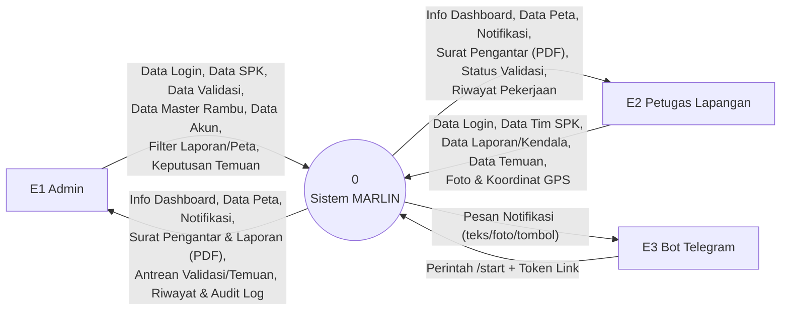
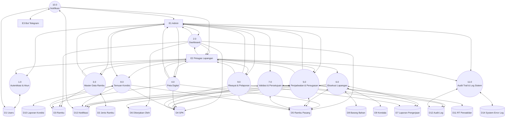
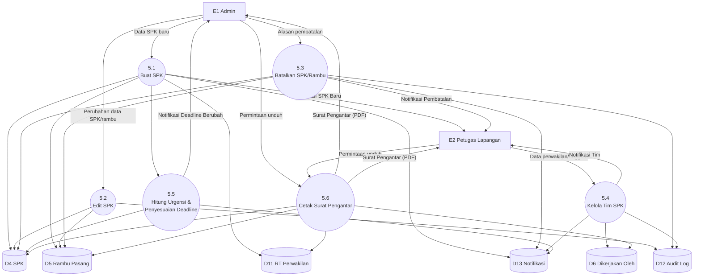
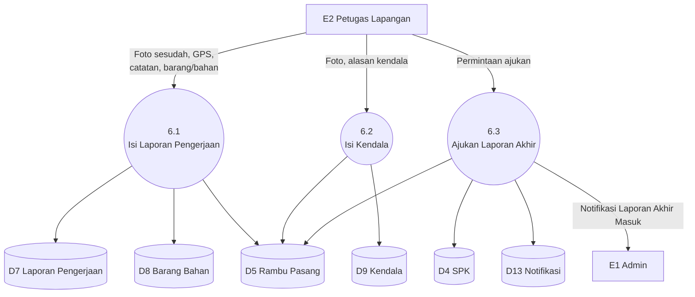
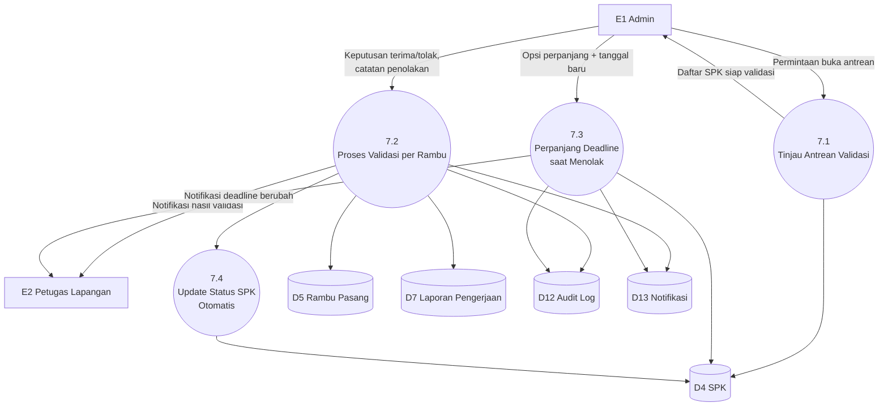

# Data Flow Diagram (DFD) Sistem MARLIN

## Pengantar

Data Flow Diagram, atau yang biasa disingkat DFD, adalah salah satu alat visualisasi paling klasik dalam dunia rekayasa perangkat lunak untuk menggambarkan bagaimana data mengalir masuk dan keluar dari sebuah sistem. Berbeda dengan diagram alur bisnis pada [ALUR-BISNIS.md](ALUR-BISNIS.md) yang menjelaskan urutan langkah dan percabangan keputusan, DFD lebih berfokus pada pertanyaan "data apa yang berpindah, dari mana ke mana, dan disimpan di mana." Dokumen ini menyusun DFD untuk Sistem MARLIN dalam beberapa tingkat kedalaman, mulai dari gambaran paling sederhana sampai dekomposisi yang cukup terperinci untuk proses-proses bisnis yang paling kompleks.

Satu hal yang perlu ditekankan sejak awal: diagram-diagram di dalam dokumen ini disusun berdasarkan fitur dan alur bisnis yang **sudah benar-benar diimplementasikan** di dalam sistem, bukan berdasarkan rancangan awal atau cita-cita yang belum tentu terwujud. Setiap kode proses, kode data store, dan kode aliran data yang muncul di sini bisa ditelusuri balik ke penjelasan yang lebih rinci pada [FITUR.md](FITUR.md), [ALUR-BISNIS.md](ALUR-BISNIS.md), [DAFTAR-AKTIVITAS.md](DAFTAR-AKTIVITAS.md), dan [DATABASE.md](DATABASE.md).

Notasi yang dipakai di seluruh dokumen ini mengikuti gaya Yourdon/DeMarco, salah satu konvensi notasi DFD yang paling banyak dipakai secara luas. Entitas Eksternal digambarkan sebagai kotak persegi, merepresentasikan pihak-pihak di luar batas sistem yang berinteraksi dengannya. Proses digambarkan sebagai lingkaran atau bubble yang diberi nomor, merepresentasikan sebuah transformasi atau pengolahan terhadap data yang masuk ke dalamnya. Data Store digambarkan sebagai bentuk silinder, diberi kode `D1`, `D2`, dan seterusnya, yang masing-masing merujuk langsung ke sebuah tabel di dalam basis data sebagaimana dijelaskan pada [DATABASE.md](DATABASE.md). Dan Aliran Data digambarkan sebagai anak panah yang diberi label, menunjukkan arah dan jenis data yang berpindah dari satu titik ke titik lainnya.

---

## Daftar Isi

- [Entitas Eksternal dan Data Store](#entitas-eksternal-dan-data-store)
- [DFD Level 0 (Diagram Konteks)](#dfd-level-0-diagram-konteks)
- [Diagram Berjenjang (Hierarchy Chart)](#diagram-berjenjang-hierarchy-chart)
- [DFD Level 1](#dfd-level-1)
- [DFD Level 2](#dfd-level-2)
  - [Level 2, Proses 5.0 Penjadwalan dan Penugasan (SPK)](#level-2-proses-50-penjadwalan-dan-penugasan-spk)
  - [Level 2, Proses 6.0 Eksekusi Lapangan](#level-2-proses-60-eksekusi-lapangan)
  - [Level 2, Proses 7.0 Validasi dan Persetujuan](#level-2-proses-70-validasi-dan-persetujuan)

---

## Entitas Eksternal dan Data Store

Sebelum masuk ke diagram-diagram itu sendiri, penting untuk terlebih dahulu memahami siapa saja pihak yang berada di luar batas sistem (entitas eksternal), dan tempat penyimpanan data apa saja yang ada di dalam sistem (data store). Kedua daftar ini menjadi kosakata dasar yang dipakai berulang-ulang di seluruh diagram berikutnya.

### Entitas Eksternal

Ada tiga entitas eksternal yang berinteraksi dengan Sistem MARLIN, dua di antaranya adalah manusia yang menggunakan sistem secara langsung, dan satu lagi adalah sebuah layanan pihak ketiga.

| Kode | Nama | Deskripsi |
|---|---|---|
| E1 | Admin | Staf Dinas Perhubungan yang membuat SPK, memvalidasi laporan, serta mengelola master data dan akun pengguna |
| E2 | Petugas Lapangan | Pihak yang mengerjakan SPK secara langsung di lapangan, mengirimkan laporan atau kendala, dan melaporkan temuan kondisi rambu |
| E3 | Bot Telegram | Sebuah layanan eksternal (Telegram Bot API) yang menerima pesan notifikasi dari sistem, dan mengirimkan kembali perintah `/start` untuk keperluan konfirmasi penghubungan akun |

### Data Store

Setiap tabel domain di dalam basis data direpresentasikan sebagai satu data store tersendiri. Tabel-tabel bawaan Laravel seperti `sessions`, `cache`, dan `jobs` sengaja tidak dimasukkan ke dalam daftar ini, karena mereka bukan merupakan bagian dari alur bisnis yang sedang digambarkan, melainkan sekadar infrastruktur teknis pendukung.

| Kode | Nama Data Store | Tabel |
|---|---|---|
| D1 | Data Pengguna | `users` |
| D2 | Data Jenis Rambu | `jenis_rambu` |
| D3 | Data Rambu | `rambu` |
| D4 | Data SPK | `spk` |
| D5 | Data Rambu Pasang | `rambu_pasang` |
| D6 | Data Tim SPK | `dikerjakan_oleh` |
| D7 | Data Laporan Pengerjaan | `laporan_pengerjaan` |
| D8 | Data Barang/Bahan | `barang_bahan` |
| D9 | Data Kendala | `kendala` |
| D10 | Data Temuan Kondisi | `laporan_kondisi` |
| D11 | Data RT/Perwakilan | `rt_perwakilan` |
| D12 | Data Audit Log | `audit_log` |
| D13 | Data Notifikasi | `notifikasi` |
| D14 | Data Log Error Sistem | `system_error_log` |

---

## DFD Level 0 (Diagram Konteks)

Diagram Konteks adalah representasi paling sederhana dari sebuah sistem: seluruh proses internal dilebur menjadi satu lingkaran tunggal, dan yang ditampilkan hanya bagaimana sistem itu secara keseluruhan berinteraksi dengan dunia luarnya. Tujuannya adalah memberi gambaran paling tinggi tentang "apa yang masuk dan keluar dari sistem ini," sebelum kita mulai membedah bagian dalamnya lebih jauh pada level-level berikutnya.

Perhatikan bagaimana admin dan petugas sama-sama mengirim dan menerima aliran data yang cukup banyak dari sistem, mencerminkan bagaimana kedua peran ini sama-sama menjadi pengguna aktif, bukan satu peran yang murni memberi perintah dan satu lagi yang murni menerima. Sementara itu, interaksi dengan Bot Telegram hanya terjadi satu arah saja pada masing-masing sisinya: sistem mengirim pesan notifikasi ke Telegram, dan Telegram hanya mengirim balik satu jenis aliran data, yaitu perintah `/start` beserta token penghubung, mencerminkan peran Telegram yang murni sebagai kanal penyampai pesan, bukan sebagai peserta aktif dalam alur bisnis itu sendiri.

### Rincian Aliran Data pada Level 0

Tabel berikut menjelaskan secara lebih rinci setiap aliran data yang tampak pada diagram di atas, memberi konteks konkret tentang apa isi dari setiap label yang tertera pada panah-panah di dalamnya.

| Kode | Dari | Ke | Nama Aliran Data | Keterangan |
|---|---|---|---|---|
| F1 | Admin | Sistem | Data Login | NIP dan kata sandi, ditambah kode 2FA apabila diaktifkan |
| F2 | Admin | Sistem | Data SPK | Membuat, mengedit, atau membatalkan SPK beserta daftar rambunya |
| F3 | Admin | Sistem | Data Validasi | Keputusan terima atau tolak sebuah laporan, beserta opsi perpanjangan tenggat waktu |
| F4 | Admin | Sistem | Data Master Rambu | Aksi tambah, ubah, atau hapus terhadap jenis rambu |
| F5 | Admin | Sistem | Data Akun Petugas | Menambah, mengubah, mengaktifkan, atau menonaktifkan akun |
| F6 | Admin | Sistem | Filter Laporan dan Peta | Rentang tanggal, jenis rambu, dan status |
| F7 | Admin | Sistem | Keputusan Tindak Lanjut Temuan | Membuat SPK perbaikan dari sebuah temuan, atau menolak temuan tersebut |
| F8 | Sistem | Admin | Info Dashboard Admin | Ringkasan SPK aktif, rambu rusak, dan laporan yang menunggu validasi |
| F9 | Sistem | Admin | Data Peta | Pin rambu beserta kartu informasinya sesuai status masing-masing |
| F10 | Sistem | Admin | Notifikasi | Laporan akhir yang masuk, temuan baru, dan berbagai peristiwa lainnya |
| F11 | Sistem | Admin | Surat Pengantar dan Laporan (PDF) | Surat Pengantar, Laporan Bulanan, dan Laporan Rambu |
| F12 | Sistem | Admin | Riwayat dan Audit Log | Riwayat SPK, serta jejak aksi bisnis penting lintas seluruh pengguna |
| F13 | Petugas | Sistem | Data Login | NIP dan kata sandi |
| F14 | Petugas | Sistem | Data Tim SPK | Mendaftarkan diri, menambah, atau menghapus anggota tim |
| F15 | Petugas | Sistem | Data Laporan Pengerjaan/Kendala | Foto, koordinat GPS, catatan, alasan, dan barang atau bahan |
| F16 | Petugas | Sistem | Data Temuan Kondisi | Foto dan catatan kerusakan rambu |
| F17 | Sistem | Petugas | Info Dashboard Petugas | Daftar surat aktif dan ringkasan tugas tim |
| F18 | Sistem | Petugas | Data Peta | Pin rambu beserta kartu informasinya sesuai status masing-masing |
| F19 | Sistem | Petugas | Notifikasi | SPK baru yang tersedia, hasil validasi, dikeluarkan dari tim, dan lainnya |
| F20 | Sistem | Petugas | Surat Pengantar (PDF) | Dokumen kerja yang dibawa ke lapangan |
| F21 | Sistem | Telegram | Pesan Notifikasi | Berupa teks, foto, dan tombol tautan, dikirim lewat Bot API |
| F22 | Telegram | Sistem | Perintah `/start` beserta Token | Konfirmasi penghubungan akun Telegram milik pengguna |

---

## Diagram Berjenjang (Hierarchy Chart)

```mermaid
graph TD
    S[0 Sistem MARLIN]

    S --> P1[1.0 Autentikasi & Manajemen Akun]
    S --> P2[2.0 Dashboard]
    S --> P3[3.0 Manajemen Data Rambu]
    S --> P4[4.0 Peta Digital Interaktif]
    S --> P5[5.0 Penjadwalan & Penugasan SPK]
    S --> P6[6.0 Eksekusi Lapangan]
    S --> P7[7.0 Validasi & Persetujuan]
    S --> P8[8.0 Temuan Kondisi]
    S --> P9[9.0 Riwayat & Pelaporan]
    S --> P10[10.0 Notifikasi]
    S --> P11[11.0 Audit Trail & Log Sistem]

    P5 --> P51[5.1 Buat SPK]
    P5 --> P52[5.2 Edit SPK]
    P5 --> P53[5.3 Batalkan SPK / Batalkan Rambu]
    P5 --> P54[5.4 Kelola Tim SPK]
    P5 --> P55[5.5 Hitung Urgensi & Penyesuaian Deadline]
    P5 --> P56[5.6 Cetak Surat Pengantar]

    P6 --> P61[6.1 Isi Laporan Pengerjaan]
    P6 --> P62[6.2 Isi Kendala]
    P6 --> P63[6.3 Ajukan Laporan Akhir]

    P7 --> P71[7.1 Tinjau Antrean Validasi]
    P7 --> P72[7.2 Proses Validasi per Rambu]
    P7 --> P73[7.3 Perpanjang Deadline saat Menolak]
    P7 --> P74[7.4 Update Status SPK Otomatis]
```

Sebelum masuk ke DFD Level 1 yang membedah isi dari lingkaran "Sistem MARLIN" pada diagram konteks di atas, ada baiknya kita melihat terlebih dahulu bagaimana keseluruhan proses di dalam sistem ini disusun secara hierarkis. Diagram berjenjang berikut menunjukkan bagaimana sebelas proses utama tingkat pertama dipecah lebih jauh menjadi sub-proses yang lebih rinci, khusus untuk tiga proses yang dianggap paling kompleks percabangan logikanya.

Mengapa Proses 5.0, 6.0, dan 7.0 yang dipilih untuk didekomposisi lebih lanjut, sementara proses-proses lainnya tidak? Alasannya berkaitan langsung dengan kompleksitas percabangan logika bisnis yang mereka miliki. Proses 1.0 sampai 4.0, dan Proses 8.0 sampai 11.0, masing-masing sudah cukup atomik untuk kebutuhan rancangan ini, meskipun detailnya tetap dijabarkan secara lengkap pada tabel Level 1 di bawah. Sebaliknya, Proses 5.0 (Penjadwalan dan Penugasan), 6.0 (Eksekusi Lapangan), dan 7.0 (Validasi dan Persetujuan) memuat logika bisnis bercabang paling banyak di antara seluruh proses yang ada, sebagaimana bisa dirasakan sendiri ketika membaca penjelasan mendalam tentang mereka pada [ALUR-BISNIS.md](ALUR-BISNIS.md). Ketiganya juga saling berhubungan erat satu sama lain, membentuk inti dari siklus hidup SPK yang menjadi jantung seluruh sistem.

---

## DFD Level 1

Diagram Level 1 membedah lingkaran tunggal "Sistem MARLIN" pada diagram konteks menjadi sebelas proses tingkat pertama, dan menampilkan bagaimana masing-masing proses tersebut berinteraksi dengan data store yang relevan baginya. Diagram ini jauh lebih padat dibandingkan diagram konteks, namun justru di sinilah mulai terlihat gambaran nyata tentang bagaimana data mengalir melalui berbagai bagian sistem.

### Rincian Proses pada Level 1

Tabel berikut menjabarkan setiap proses tingkat pertama secara lebih rinci: siapa aktor yang terlibat, data apa saja yang menjadi masukan dan keluarannya, dan data store mana saja yang dilibatkan olehnya.

| Kode | Nama Proses | Aktor | Input | Output | Data Store |
|---|---|---|---|---|---|
| 1.0 | Autentikasi & Manajemen Akun | Admin, Petugas | NIP+kata sandi, kode 2FA, data akun (khusus admin), data profil sendiri | Sesi login atau pesan gagal, data akun yang tersimpan | D1 |
| 2.0 | Dashboard | Admin, Petugas | Permintaan membuka dashboard, filter widget peta (khusus admin) | Ringkasan angka (SPK aktif, rambu rusak, dan sejenisnya), widget peta ringkas | D3, D4, D5, D6 |
| 3.0 | Manajemen Data Rambu | Admin (mengelola), Petugas (melihat) | Data jenis rambu (untuk aksi tambah/ubah/hapus), permintaan daftar rambu | Master data jenis rambu yang tersimpan, daftar rambu yang tersaring |D2, D3 |
| 4.0 | Peta Digital Interaktif | Admin, Petugas | Filter peta (jenis/tingkat/tanggal), permintaan unduh PDF sebaran | Pin peta beserta kartu informasinya, berkas PDF sebaran rambu | D3, D4, D5 |
| 5.0 | Penjadwalan & Penugasan (SPK) | Admin (membuat/mengedit/membatalkan), Petugas (mengelola tim) | Data SPK baru atau perubahan, alasan pembatalan, data tim | SPK yang tersimpan, PDF surat pengantar, notifikasi tim | D4, D5, D6, D11, D12, D13 |
| 6.0 | Eksekusi Lapangan | Petugas (perwakilan) | Foto, GPS, catatan (laporan), foto dan alasan (kendala), permintaan ajukan laporan akhir | Status rambu yang berubah, SPK yang masuk antrean validasi | D4, D5, D7, D8, D9, D13 |
| 7.0 | Validasi & Persetujuan | Admin | Keputusan terima atau tolak per rambu, catatan penolakan, opsi perpanjangan tenggat waktu | Status rambu selesai atau revisi, SPK yang selesai secara otomatis, notifikasi | D4, D5, D7, D12, D13 |
| 8.0 | Temuan Kondisi | Petugas (melapor), Admin (menindaklanjuti) | Foto dan catatan kondisi rusak, keputusan membuat SPK atau menolak | Kondisi rambu yang diperbarui, SPK perbaikan baru (opsional), notifikasi | D3, D4, D5, D10, D13 |
| 9.0 | Riwayat & Pelaporan | Admin, Petugas | Filter tanggal, jenis, atau status | Halaman riwayat, berkas PDF (Laporan Bulanan/Rambu) | D4, D5, D7 |
| 10.0 | Notifikasi | Admin, Petugas, Bot Telegram | Peristiwa bisnis dari proses lain (pemicu internal), token untuk menghubungkan Telegram | Notifikasi in-app, pesan Telegram | D1, D13 |
| 11.0 | Audit Trail & Log Sistem | Admin, Petugas (melihat aktivitas sendiri) | Peristiwa aksi bisnis penting (pemicu internal), exception yang tidak tertangani | Halaman Audit Log, halaman System Error Log | D12, D14 |

---

## DFD Level 2

Untuk ketiga proses yang paling kompleks percabangan logikanya, yaitu Proses 5.0, 6.0, dan 7.0, dokumen ini mendekomposisinya lebih jauh lagi ke dalam DFD Level 2. Pada level ini, setiap sub-proses digambarkan sebagai lingkaran tersendiri, menunjukkan bagaimana sebuah proses yang tampak sederhana pada Level 1 sebenarnya terdiri dari beberapa langkah pengolahan data yang saling terhubung.

### Level 2, Proses 5.0 Penjadwalan dan Penugasan (SPK)

Proses ini mencakup segala sesuatu yang berkaitan dengan siklus administratif sebuah SPK, mulai dari dibuat sampai dicetak sebagai dokumen resmi.

Perhatikan bagaimana Proses 5.5 (Hitung Urgensi dan Penyesuaian Deadline) menjadi semacam "sub-rutin" yang dipanggil oleh Proses 5.1, mencerminkan kenyataan bahwa penghitungan urgensi memang bukan sebuah aksi mandiri yang dipicu langsung oleh admin, melainkan sebuah efek samping otomatis yang selalu menyertai proses pembuatan atau pengubahan SPK.

| Kode | Nama Proses | Input | Proses | Output | Data Store |
|---|---|---|---|---|---|
| 5.1 | Buat SPK | Alamat, tenggat waktu, daftar rambu (setiap baris memilih jenis pekerjaannya sendiri, pasang baru atau perbaikan), berkas referensi | Menyimpan SPK beserta baris `rambu_pasang` (jenis pekerjaan disimpan per baris, satu SPK boleh mencampur keduanya), memanggil Proses 5.5 untuk menghitung urgensi, mengirim notifikasi ke seluruh petugas aktif | SPK yang tersimpan (berstatus Aktif), notifikasi "SPK Baru Tersedia" | D4, D5, D11, D13 |
| 5.2 | Edit SPK | Perubahan pada header atau daftar rambu (hanya untuk SPK berstatus Aktif, dan hanya baris rambu yang statusnya masih Belum/Urgent/Revisi yang bisa diubah) | Memperbarui data, mencatat ke audit log | SPK atau rambu_pasang yang terbarui | D4, D5, D12 |
| 5.3 | Batalkan SPK / Batalkan Rambu | Konfirmasi beserta alasan (untuk pembatalan satu rambu) | Mengubah status menjadi Dibatalkan atau Batal, mencatat audit log, mengirim notifikasi ke tim | Status yang terbarui, notifikasi pembatalan | D4, D5, D12, D13 |
| 5.4 | Kelola Tim SPK | Data perwakilan dan anggota (untuk aksi daftar/tambah/hapus), hanya untuk SPK yang masih Aktif | Menyimpan atau menghapus baris tim, mencatat audit log, mengirim notifikasi | Tim yang tersimpan, notifikasi kepada anggota terkait | D6, D12, D13 |
| 5.5 | Hitung Urgensi & Penyesuaian Deadline | Tenggat waktu beserta status prioritas SPK | Menghitung urgensi (dua hari atau kurang, tujuh hari atau kurang, atau selebihnya), dan apabila SPK baru ditandai Prioritas, menggeser tenggat waktu SPK aktif non-prioritas lain (bersifat maksimal, tidak akumulatif) | Urgensi SPK, tenggat waktu SPK lain yang terbarui, notifikasi perubahan tenggat waktu | D4, D13 |
| 5.6 | Cetak Surat Pengantar | Permintaan unduh dari admin atau anggota tim SPK terkait | Menyusun dokumen dari data SPK, daftar rambu, tim, dan RT/perwakilan | Berkas PDF surat pengantar | D4, D5, D6, D11 |

---

### Level 2, Proses 6.0 Eksekusi Lapangan

Proses ini mencakup segala sesuatu yang dilakukan perwakilan tim petugas saat bekerja di lapangan, sampai momen mereka mengajukan Laporan Akhir.

Perlu diperhatikan bahwa Proses 6.1 dan 6.2 sama sekali tidak mengirimkan notifikasi apa pun kepada admin secara langsung, hanya Proses 6.3 yang melakukannya. Ini secara visual mencerminkan prinsip validasi per-batch yang dijelaskan mendalam pada [ALUR-BISNIS.md](ALUR-BISNIS.md): admin baru diberi tahu setelah seluruh rambu tertangani dan Laporan Akhir benar-benar diajukan, bukan setiap kali satu rambu selesai dilaporkan.

| Kode | Nama Proses | Input | Proses | Output | Data Store |
|---|---|---|---|---|---|
| 6.1 | Isi Laporan Pengerjaan | Foto sesudah (wajib), koordinat GPS (wajib), catatan lapangan, daftar barang atau bahan, hanya oleh perwakilan tim | Menolak apabila foto atau GPS kosong; menyimpan laporan; mengubah status rambu_pasang menjadi Menunggu Validasi | Laporan pengerjaan yang tersimpan, status rambu yang berubah | D5, D7, D8 |
| 6.2 | Isi Kendala | Foto (wajib), alasan (wajib), hanya oleh perwakilan tim | Menyimpan kendala; mengubah status rambu_pasang menjadi Tertunda | Kendala yang tersimpan, status rambu yang berubah | D5, D9 |
| 6.3 | Ajukan Laporan Akhir | Permintaan dari perwakilan tim | Memvalidasi syarat: minimal satu rambu Tertunda/Menunggu Validasi dan tidak ada yang masih Belum/Revisi; mengatur `laporan_akhir_diajukan_at` | SPK masuk antrean Validasi Pengerjaan, notifikasi kepada admin pembuat SPK | D4, D5, D13 |

---

### Level 2, Proses 7.0 Validasi dan Persetujuan

Proses ini mencakup segala sesuatu yang dilakukan admin saat meninjau dan mengambil keputusan atas laporan-laporan yang sudah diajukan.

Perhatikan bagaimana Proses 7.4 (Update Status SPK Otomatis) tidak menerima aliran data langsung dari aktor mana pun, melainkan hanya dipicu secara internal oleh Proses 7.2. Ini mencerminkan sifatnya yang sepenuhnya otomatis: tidak ada tombol atau aksi eksplisit yang perlu ditekan admin untuk mengubah status SPK menjadi selesai, sistem melakukannya sendiri begitu syaratnya terpenuhi.

| Kode | Nama Proses | Input | Proses | Output | Data Store |
|---|---|---|---|---|---|
| 7.1 | Tinjau Antrean Validasi | Permintaan buka daftar (dari admin) | Menampilkan SPK yang `laporan_akhir_diajukan_at`-nya sudah terisi, termasuk seluruh rambu di dalamnya (bukan hanya yang baru) | Daftar SPK yang siap divalidasi | D4 |
| 7.2 | Proses Validasi per Rambu | Keputusan terima atau tolak per rambu, catatan penolakan (wajib untuk yang ditolak) | Rambu yang berstatus Tertunda (karena kendala) dipaksa tidak bisa diterima di sisi server; yang diterima berubah menjadi Selesai (`sudah_terpasang` atau `kondisi_terkini` ikut berubah), yang ditolak berubah menjadi Revisi; gerbang `laporan_akhir_diajukan_at` direset; mencatat audit log dan notifikasi | Status laporan/rambu yang terbarui, notifikasi kepada petugas | D5, D7, D12, D13 |
| 7.3 | Perpanjang Deadline saat Menolak | Kotak centang "beri kelonggaran" beserta tanggal baru, satu transaksi dengan Proses 7.2 | Memperbarui `deadline` dan `deadline_asli`, menghitung ulang urgensi, mencatat audit log, mengirim notifikasi ke seluruh tim | Tenggat waktu SPK yang terbarui, notifikasi tim | D4, D12, D13 |
| 7.4 | Update Status SPK Otomatis | Pemicu internal setelah Proses 7.2 selesai | Memeriksa apakah seluruh `rambu_pasang` sudah Selesai atau Batal | Status SPK menjadi Selesai, `selesai_pada` tercatat | D4 |

---

## Catatan Penggunaan Dokumen Ini

Kode data store (`D1` sampai `D14`) dan kode proses (`1.0` sampai `11.0`, beserta turunannya seperti `X.Y`) dipakai secara konsisten di seluruh dokumen ini, sehingga bisa langsung dirujuk silang dari [DATABASE.md](DATABASE.md) dan [DAFTAR-AKTIVITAS.md](DAFTAR-AKTIVITAS.md) tanpa perlu penomoran ulang.

Proses 1.0 sampai 4.0, 8.0, 9.0, 10.0, dan 11.0 sengaja tidak diberi diagram Level 2 tersendiri di dalam dokumen ini karena masing-masing sudah cukup sederhana untuk direpresentasikan sebagai satu proses atomik pada Level 1. Apabila suatu saat dibutuhkan dekomposisi lebih lanjut untuk salah satu di antaranya, pola yang bisa diikuti sama seperti pola yang sudah diterapkan pada Proses 5.0, 6.0, dan 7.0 di atas.

Seluruh diagram pada dokumen ini disusun menggunakan sintaks Mermaid, yang akan otomatis dirender sebagai gambar visual pada GitHub, pada Visual Studio Code (dengan ekstensi Markdown Preview Mermaid Support terpasang), dan pada berbagai editor Markdown modern lainnya yang mendukung sintaks ini.
